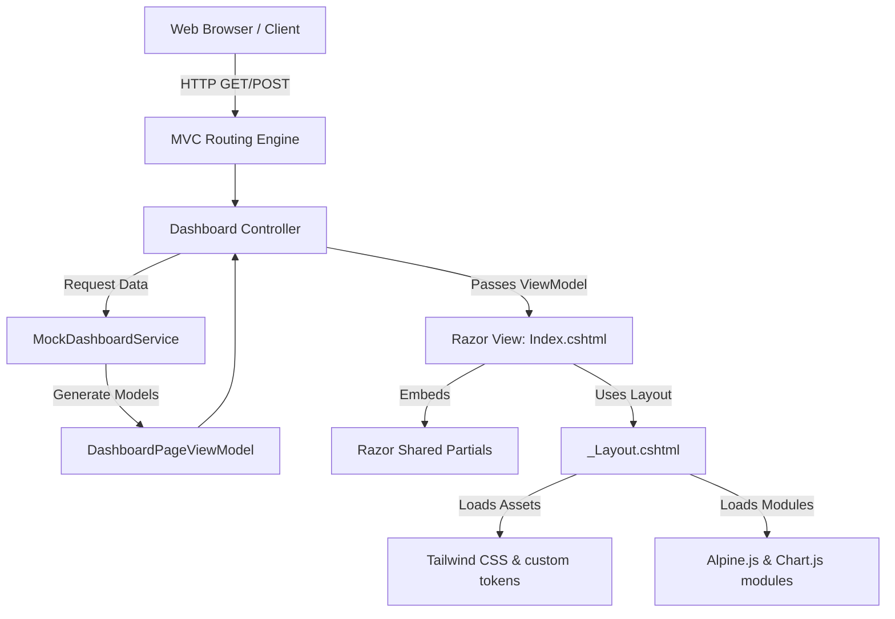
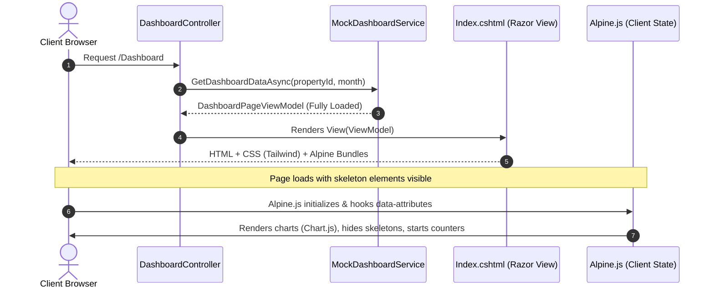
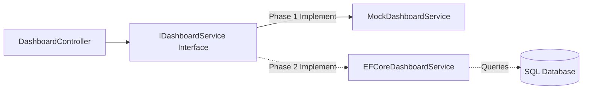

# Frontend Architecture - Trọ Sinh Viên (Internal technical name: TroHub)

This document describes the design patterns, layouts, frameworks, and component structures supporting the frontend rendering engine.

---

## 1. High-Level Architecture Overview

**Trọ Sinh Viên** (internally coded as **TroHub**) is structured as a standard monolithic ASP.NET Core MVC application with progressive enhancement overlays.



---

## 2. Request and Rendering Flow

The visual layout renders serverside. User interactions execute clientside using modular JS and Alpine.js.



---

## 3. Razor View Organization

Razor templates are structured modularly to avoid monolithic views.

```
Views/
├── Dashboard/
│   ├── Index.cshtml                  # Dashboard Main Page entry
│   └── Partials/                     # Page-specific components
│       ├── _DashboardHero.cshtml     # Animated welcome hero
│       ├── _RevenueOverview.cshtml   # Line chart panel
│       ├── _OccupancyOverview.cshtml # Donut chart panel
│       ├── _RecentInvoices.cshtml    # Invoices grid/table
│       ├── _OverduePayments.cshtml   # Uncollected bills lists
│       ├── _ExpiringContracts.cshtml # Lease alerts
│       ├── _MaintenanceRequests.cshtml # Urgent work order logs
│       ├── _ActivityTimeline.cshtml  # History timeline list
│       └── _QuickActions.cshtml      # Fast access dashboard
└── Shared/
    ├── _Layout.cshtml                # Global application layout wrapper
    ├── _Sidebar.cshtml               # Collapsible desktop sidebar panel
    ├── _Topbar.cshtml                # Navigation sticky header
    ├── _MobileNavigation.cshtml      # Accessible mobile nav drawer
    ├── _Breadcrumb.cshtml            # Multi-level position indicator
    ├── _PropertySelector.cshtml      # Dynamic boarding house switcher
    ├── _SearchCommand.cshtml         # Search drawer trigger popup
    ├── _NotificationPanel.cshtml     # Slidedown alerts drawer
    ├── _UserMenu.cshtml              # Desktop profile panel dropdown
    ├── _StatCard.cshtml              # Generic numeric statistics card
    ├── _StatusBadge.cshtml           # Badge rendering for status states
    ├── _EmptyState.cshtml            # Reusable empty list placeholder
    ├── _SkeletonLoader.cshtml        # CSS-animated shimmer placeholder
    ├── _ConfirmModal.cshtml          # Alert action dialogue box
    └── _ToastContainer.cshtml        # Float overlay toast notification stack
```

---

## 4. CSS Architecture

*   **Tailwind CSS:** Acts as the primary styling framework.
*   **Design Tokens:** Encapsulated in the root configuration file and injected into `wwwroot/css/site.css` using custom properties.
*   **Encapsulation:** Large tailwind utility lists are avoided within View files by writing structural CSS utility classes inside `site.css` when appropriate, e.g. using `@apply` directive for repeat widgets.

---

## 5. JavaScript Module Architecture

JavaScript files are organized by scope to avoid a single global script.

```
wwwroot/js/
├── app/
│   ├── navigation.js        # Sidebar toggles, mobile drawer focus traps
│   ├── dropdowns.js         # Menu displays, modal overlays, toasts
│   ├── dialogs.js           # Focus trapping dialog controllers
│   └── toasts.js            # In-app notification triggers
└── dashboard/
    ├── dashboard.js         # Main coordinator
    ├── hero-motion.js       # Parallax, ambient lights, cloud/lake shimmer
    ├── counters.js          # IntersectionObserver number count animations
    ├── charts.js            # Chart.js initialization & dynamic tooltips
    └── viewport-motion.js   # Progressive section reveal observers
```

---

## 6. Separation between UI, Mock Services, and Future Services

This architecture separates the visual layer from the data retrieval mechanism. Moving from mockup to SQL Server later will require zero Razor edits.



---

## 7. Progressive Enhancement & Accessibility Strategy

*   **HTML First:** Page structure behaves perfectly without JS. Fallback static text represents charts, and details lists operate natively.
*   **Transitions:** Custom transitions occur via standard CSS animation rules. If a script fails, components remain visible and interactable.
*   **Esc Key and Click-Outs:** Managed universally for dialogs and menus using standard keyboard triggers.
