# Dashboard Technical Specification - Trọ Sinh Viên (Internal technical name: TroHub)

This document specifies the information architecture, section order, components, charts, and interaction paradigms of the landlord dashboard.

---

## 1. Information Hierarchy & Layout

The dashboard is structured using a multi-grid layout responsive to viewports.

### Page Grid Layout (Desktop)
*   **Header Zone:** Title, Month Selector, Main Actions.
*   **Section 1 (Hero Zone):** 100% width welcome hero banner.
*   **Section 2 (Stats Zone):** 5-column grid displaying key operational metrics.
*   **Section 3 (Charts Zone):** 2-column grid (Revenue Overview Chart: 66% width, Occupancy Donut: 33% width).
*   **Section 4 (Main Content Zone):** 3-column layout:
    *   **Column A (66%):** Recent Invoices Table, Overdue Payments Panel, Expiring Contracts Panel, Maintenance Tickets Panel.
    *   **Column B (33%):** Activity Timeline Panel, Quick Actions panel.

---

## 2. Dashboard Component Hierarchy

```mermaid
graph TD
    AppLayout[_Layout.cshtml] --> DashboardIndex[Index.cshtml]
    DashboardIndex --> Header[Dashboard Header + Filters]
    DashboardIndex --> WelcomeHero[_DashboardHero.cshtml]
    DashboardIndex --> StatsGrid[5x Stats Cards Grid]
    StatsGrid --> StatCard1[_StatCard.cshtml: Total Rooms]
    StatsGrid --> StatCard2[_StatCard.cshtml: Occupied Rooms]
    StatsGrid --> StatCard3[_StatCard.cshtml: Vacant Rooms]
    StatsGrid --> StatCard4[_StatCard.cshtml: Current Month Revenue]
    StatsGrid --> StatCard5[_StatCard.cshtml: Pending/Overdue Debts]
    DashboardIndex --> ChartsGrid[Charts Section]
    ChartsGrid --> RevChart[_RevenueOverview.cshtml]
    ChartsGrid --> OccChart[_OccupancyOverview.cshtml]
    DashboardIndex --> LowerGrid[Lower Activity & Lists Section]
    LowerGrid --> InvoicesPanel[_RecentInvoices.cshtml]
    LowerGrid --> OverduePanel[_OverduePayments.cshtml]
    LowerGrid --> ContractsPanel[_ExpiringContracts.cshtml]
    LowerGrid --> MaintenancePanel[_MaintenanceRequests.cshtml]
    LowerGrid --> QuickActionsPanel[_QuickActions.cshtml]
    LowerGrid --> TimelinePanel[_ActivityTimeline.cshtml]
```

---

## 3. Detailed Component Spec & Interactions

### 3.1. Premium Welcome Hero (`_DashboardHero.cshtml`)
*   **Left Column (55%):** Vietnamese greeting ("Chào buổi sáng, Anh Thủy"), localized summary of current day, short operations description, quick stat badges (Occupied / Total rooms), and main CTA buttons ("Tạo hóa đơn tháng này", "Thêm phòng mới").
*   **Right Column (45%):** The provided landscape image (`dashboard-hero-landscape.png`) masked inside a subtle frame with water shimmer overlay, ambient light shifts, and horizontal/zoom transformations.
*   **Interactions:** Hovering over the image activates slow motion effects. Moving the pointer on desktop triggers mild parallax.

### 3.2. Key Statistics Cards (`_StatCard.cshtml`)
*   **Data Fields:** Icon, Title, Value, Comparison Trend (Percentage indicator & green/red color), description.
*   **Variation:** Financial cards (Revenue, Debt) feature a micro-sparkline graph indicating trends over the last 6 months.

### 3.3. Revenue Overview Line Chart (`_RevenueOverview.cshtml`)
*   **Type:** Area/Line chart using Chart.js.
*   **Design:** Curved line with subtle gradient fill under the line. Gridlines are muted slate-100.
*   **Interactive Tooltip:** Custom HTML tooltip showing month, revenue, expenses, and growth rate on hover.

### 3.4. Room Occupancy Donut Chart (`_OccupancyOverview.cshtml`)
*   **Type:** Doughnut chart using Chart.js.
*   **Slices:** Occupied (Emerald), Available (Slate), Maintenance (Amber).
*   **Center Label:** Bold percentage text (e.g. `79%`) with "Đã thuê" caption underneath.

### 3.5. Tables & Operational Panels
*   **Recent Invoices Table:** Columns for Room Code, Tenant Name, Due Date, Total, Status, Action. In mobile mode, table cells transform to cards.
*   **Overdue Payments List:** Rooms showing overdue bills with warning alerts and active "Liên hệ" (Contact via Zalo/SMS) CTAs.
*   **Expiring Contracts List:** Displays upcoming lease expirations (within 30 days) with remaining days countdowns and a "Gia hạn" action.
*   **Maintenance requests:** Color-coded priority badges (High: Rose, Medium: Amber, Low: Slate).
*   **Activity Timeline:** Vertical list with line paths connecting action indicators.
*   **Quick Actions:** 6 grids leading to placeholder paths with active feedback.

---

## 4. Localisation & Formatting Rules

*   **Currency Formatting:** Values must format using C# `CultureInfo.GetCultureInfo("vi-VN")`. Example output: `58.400.000 ₫`. In abbreviated formats: `58,4 triệu ₫` or `7,8 triệu ₫`.
*   **Dates:** Format as `dd/MM/yyyy` (e.g., `12/07/2026`).
*   **Timeline Timestamps:** Relative formats in Vietnamese, e.g., "10 phút trước" (10 minutes ago), "2 giờ trước" (2 hours ago), "Hôm qua" (Yesterday).
