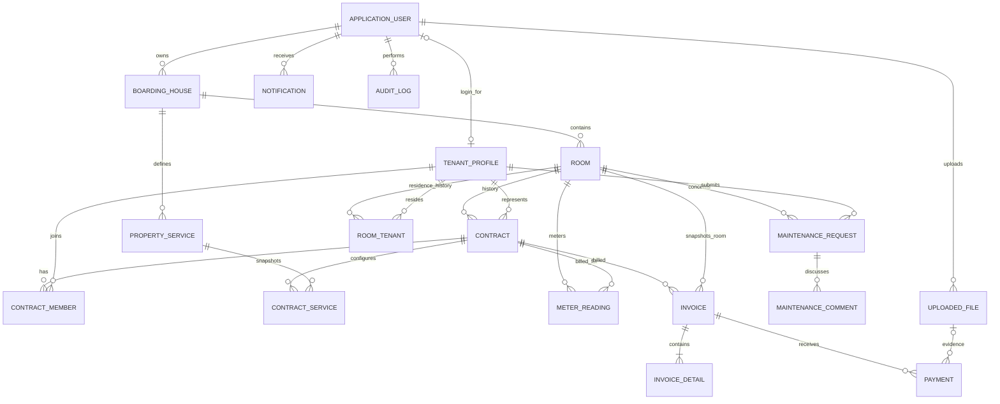

# Entity Relationship Diagram

`RoomTenant` là lịch sử cư trú thực tế; `ContractMember` là quan hệ pháp lý với hợp đồng. Tenant chỉ có tối đa một `RoomTenant` chưa có `MoveOutDate`; service và transaction đảm bảo invariant này. Contract và invoice giữ snapshot giá để thay đổi catalog không sửa lịch sử.
